# Síntesis de Acetaminofén (Paracetamol)

**Autor:** Mariana Lopera Correa

---

# 1. INTRODUCCIÓN

## A. Contexto Histórico

El acetaminofén (paracetamol) es uno de los fármacos más utilizados a nivel mundial. Aunque fue sintetizado por primera vez en 1878 por Harmon Northrop Morse, su valor clínico permaneció ignorado durante décadas. Inicialmente, el mercado estuvo dominado por alternativas más tóxicas como la acetanilida y la fenacetina. No fue hasta finales de la década de 1940 que estudios en la Universidad de Yale demostraron que el paracetamol es el metabolito activo y seguro de estos fármacos previos, ofreciendo excelente analgesia sin sus severos efectos adversos (como la methemoglobinemia y la nefrotoxicidad). Este descubrimiento catalizó su comercialización masiva en 1955 bajo la marca Tylenol, marcando un hito en la farmacología.

## B. Reacción General

La síntesis química del acetaminofén (N-(4-hidroxifenil)acetamida) se basa fundamentalmente en la acilación del 4-aminofenol [1, 2]. En esta reacción, empleamos anhídrido acético para transferir un grupo acilo y convertir la amina primaria en una amida estable, un proceso que genera ácido acético como subproducto natural [4].

## C. Revisión Bibliográfica

La siguiente tabla resume fuentes fundamentales para la comprensión de la termodinámica, cinética y las condiciones experimentales de la síntesis del acetaminofén.

| Título del Artículo / Documento | Revista / Fuente | Cuartil (Scimago) / Tipo | Enlace |
| :--- | :--- | :--- | :--- |
| *Design synthesis and crystallization of acetaminophen* [1] | Journal of Chemical, Biological and Physical Sciences | Q4 | [www.jcbsc.org](http://www.jcbsc.org) |
| *Paracetamol - a curriculum resource* [2] | Royal Society of Chemistry | Recurso Educativo | [chemsoc.org](http://www.chemsoc.org/networks/learnnet/paracetamol.htm) |
| *Solvent free synthesis of acetaminophen* [3] | U.S. Patent 9,006,488 B1 | Patente | [patents.google.com](https://patents.google.com/patent/US9006488B1/en) |
| *Two-Step Synthesis of Paracetamol: A Laboratory Experiment...* [4] | Journal of Chemical Education | Q1 | [ACS Link](https://pubs.acs.org/doi/10.1021/acs.jchemed.3c00549) |
| *How Efficient Is My (Medicinal) Chemistry?* [5] | Pharmaceuticals | Q1 | [PMC Link](https://pmc.ncbi.nlm.nih.gov/articles/PMC4932544/) |

### Artículos más relevantes 

* **Srabovic et al. (2017) - *Design synthesis and crystallization of acetaminophen* [1]:**
Este artículo sirve para mejorar el experimento porque compara cuatro maneras de hacer la reacción. Demuestra que si calentamos la mezcla por 15 minutos sin agregar ácidos, se logra el mejor equilibrio: mucha cantidad de producto (70.77%) y casi total pureza (99.20%). El texto también explica cómo purificarlo mejor probando varios solventes.

* **Royal Society of Chemistry - *Paracetamol a curriculum resource* [2]:**
Es la base del procedimiento de laboratorio, justifica la viabilidad de realizar la síntesis en medio acuoso a temperatura ambiente o con calentamiento suave.

* **Parveen et al. (2023) - *Two-Step Synthesis of Paracetamol...* [4]:**
Resulta fundamental para comprender la justificación mecanística de la quimioselectividad. El 4-aminofenol es un nucleófilo ambidentado (posee grupos -NH₂ y -OH). Este documento demuestra que la N-acetilación es cinéticamente preferida debido a que el par de electrones libres del nitrógeno es más polarizable y presenta una menor barrera de energía de activación para el ataque al carbono carbonílico en comparación con el oxígeno fenólico.

---

## B. Condiciones de Reacción Reportadas

La literatura exhibe flexibilidad en las condiciones para esta síntesis, demostrando que la acilación es altamente favorable bajo diversos entornos termodinámicos.

| Referencia | Solvente | Temperatura | Tiempo de Reacción | Relación Molar (Amina:Anhídrido) | Rendimiento (%) | Observaciones Relevantes |
| :--- | :--- | :--- | :--- | :--- | :--- | :--- |
| **Srabovic [1] (Método III)** | Agua | Reflujo suave | 15 min | Exceso de acilante | 70.77% | Sin catalizador; alta pureza directa (99.20%). |
| **Srabovic [1] (Método I)** | Agua | Baño maría | 20 min | No especificada | 55.36% | Catálisis con H₃PO₄ concentrado. Requiere recristalización extensa. |
| **RSC [2] ** | Agua | Ambiente | 10 - 12 min | ~ 1 : 1.27 | 60% (crudo) | La suspensión inicial se disuelve exotérmicamente y luego precipita. |
| **Amin et al. [3] (Patente)** | Sin solvente | Ambiente (fricción) | < 15 min | 1 : 1.05 | > 95% | Síntesis mecanoquímica: la fricción aporta la energía necesaria para que ocurra la reacción.|

---

## C. Procedimiento Experimental Detallado

Este procedimiento describe la síntesis del acetaminofén utilizando agua como solvente, basándose en los protocolos de Srabovic [1] y la Royal Society of Chemistry [2].

### Fase 1: Preparación de Reactivos
1. **Acción:** En un Erlenmeyer de 50 mL, suspender 1.0 g de 4-aminofenol en 9.0 mL de agua destilada. Agitar magnéticamente a temperatura ambiente.

2. **Justificación:** El 4-aminofenol tiene baja solubilidad en agua a temperatura ambiente, por lo que inicialmente se observará una suspensión heterogénea [2]. El uso de agua es ideal porque no compite significativamente como nucleófilo frente a la amina.

### Fase 2: Acilación 
3. **Acción:** En una campana de extracción, añadir 1.1 mL de anhídrido acético al Erlenmeyer con la suspensión, manteniendo la agitación.

4. **Justificación y Química:** El anhídrido acético es el encargado de transferir el grupo acilo. Para asegurarnos de que todo el 4-aminofenol reaccione por completo, se agrega un 27% más de anhídrido de lo que pide la teoría. Este extra es indispensable en la práctica porque compensa el anhídrido que se destruye al entrar en contacto con el agua. Químicamente, el nitrógeno del 4-aminofenol ataca al carbono del anhídrido acético. Esto une ambas moléculas brevemente en un estado intermedio, antes de que la estructura se rompa para liberar ácido acético como subproducto. Al final, el exceso de anhídrido sobrante simplemente se transforma en ácido acético y se elimina fácilmente al lavar el producto con agua, dejando el compuesto final limpio y formado.

### Fase 3: Progresión y Cristalización Primaria
6. **Acción:** Continuar la agitación durante aproximadamente 10 a 15 minutos. Transcurrido este tiempo, retirar de la placa de agitación y sumergir el Erlenmeyer en un baño de agua y hielo durante 15 minutos.
7. **Justificación y Química:** Pasados los primeros minutos de reacción, el acetaminofén formado comenzará a precipitar. El enfriamiento en baño de hielo disminuye la solubilidad del acetaminofén en agua (cayendo a 1.43 g/100 mL a 0 °C), empujando el equilibrio de fases hacia la cristalización [1, 2]. El subproducto, ácido acético permanece disuelto en la fase acuosa.

### Fase 4: Aislamiento del producto crudo (Filtración)
8. **Acción:** Filtrar el sólido al vacío empleando un embudo Büchner y un Kitasato. Lavar el producto filtrado con 5 mL de agua destilada helada.

9. **Justificación:** La filtración al vacío separa rápidamente el producto crudo de las aguas ácidas. El lavado con agua *helada* es crítico: retira los remanentes de ácido acético y trazas de 4-aminofenol sin disolver el acetaminofén recién cristalizado [2].

### Fase 5: Purificación del producto (Recristalización)
10. **Acción:** Transferir el acetaminofén crudo a un Erlenmeyer limpio. Añadir una cantidad mínima de agua destilada caliente (aproximadamente 10-15 mL a 80 °C) hasta disolución total.
11. **Justificación y Química:** La recristalización se basa en la cristalización fraccionada térmica. Al calentar, el acetaminofén se disuelve por completo aprovechando su alta solubilidad en caliente (5.0 g/100 mL). Los cristales que crecen lentamente al enfriar excluyen las impurezas de suácido red cristalina [1].

12. **Acción:** Permitir que la solución se enfríe lentamente a temperatura ambiente y posteriormente aplicar baño de hielo para maximizar el rendimiento. Filtrar nuevamente al vacío y proceder al secado de los cristales.

### Fase 6: Análisis y Caracterización
13. **Acción:** Secar el producto recristalizado en una estufa a baja temperatura (60 °C) o mediante vacío prolongado. 

---

# 2. Optimización de Geometría con xTB

| Reactivo | PubChem CID | Estructura |
| :--- | :--- | :--- | 
| 4-aminofenol | 403 | 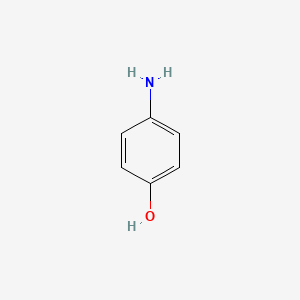 |
| Anhídrido acético | 7918 | 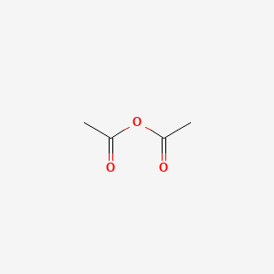 |

## 2.2 Modelo de Solvatación ALPB en xTB

El **modelo de Solvatación ALPB** de la librería xTB, representa una evolución del método de Solvatación Generalizada de Born (GBSA). Este modelo está diseñado específicamente para abordar las limitaciones del método GBSA tradicional, especialmente en sistemas orgánicos y cuando se requiere alta precisión en las energías de solvatación.

### Fundamento Conceptual

El método ALPB parte de los mismos principios de la teoría de Solvatación de Born, que trata al solvente como un medio continuo polar que interactúa con un soluto polar. Sin embargo, ALPB introduce mejoras cruciales en la definición de las superficies de contacto y en el cálculo de las energías.

1. **Superficies de Contacto Mejoradas:**
   En los métodos GBSA estándar, la superficie de contacto entre el soluto y el solvente se define a menudo utilizando radios de Van der Waals simples. Esto puede generar problemas en sistemas con geometrías complejas, como puentes de hidrógeno, donde la distribución de carga no sigue una forma esférica simple.
   ALPB utiliza una aproximación de superficie de contacto más estricta. En lugar de esferas simples, define una superficie que representa la región del espacio molecular que está expuesta al solvente. Esto se logra mediante un cálculo que considera la forma real de la nube electrónica del soluto, asegurando que la interacción con el solvente sea físicamente más realista.

2. **Límite de Born-Oppenheimer:**
   El nombre del modelo hace referencia a una corrección matemática y física específica que se aplica para asegurar que la energía de solvatación sea consistente con los principios de la mecánica cuántica fundamental.

3. **Aproximación de Gausiana Generalizada:**
   Para calcular la energía de polarización de manera eficiente, ALPB aproxima la función de densidad electrónica del soluto mediante una suma de distribuciones gaussianas (una por cada átomo). Esto permite un cálculo numérico rápido y estable de la interacción electrostática con el campo del solvente.

Y para la utilizacion de la solvatacion se uso el comando: `xtb nombre_archivo.xyz --opt --alpb water`

---

# 3. Cálculos y análisis de frecuencias y vibraciones

#### Sistema sin solvente

Al analizar espectros infrarrojos (IR) calculados computacionalmente, las frecuencias ($\nu$) observadas corresponden a modos normales de vibración teóricos, los cuales a menudo aparecen a números de onda ligeramente mayores que los empíricos debido a la ausencia de interacciones intermoleculares y a la aproximación de los cálculos.

**1. Anhídrido Acético (Fase Gas)**

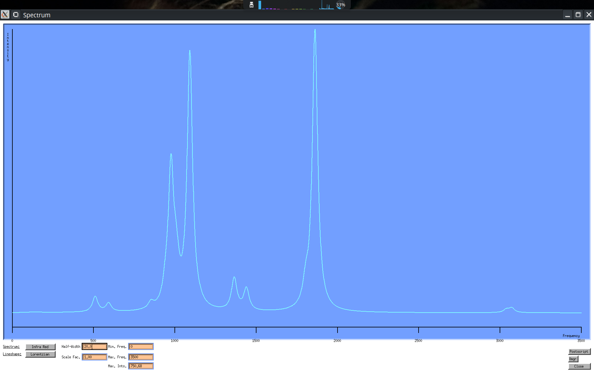

El espectro muestra señales predominantes características del grupo anhídrido:
* **~1850 $cm^{-1}$ y ~1900 $cm^{-1}$:** Corresponden al stretching simétrico ($\nu_{s}$) y stretching asimétrico ($\nu_{as}$) de los dos grupos carbonilo ($C=O$). En los anhídridos, el acoplamiento a través del oxígeno central divide la señal en dos bandas distintas. En cálculos teóricos, estas frecuencias están desplazadas hacia la izquierda respecto al estándar experimental (1750-1820 $cm^{-1}$).
* **~1100 - 1150 $cm^{-1}$:** Modos de stretching correspondientes al stretching asimétrico del enlace éter interno ($C-O-C$).

**2. 4-Aminofenol (Fase Gas)**

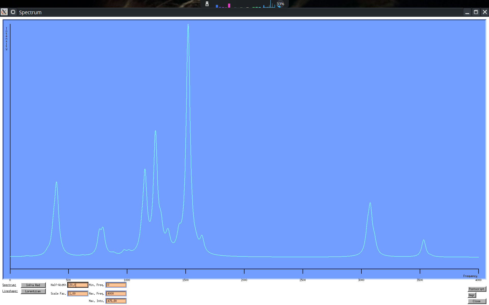

El espectro muestra señales agudas a muy altas frecuencias, un comportamiento clásico de heteroátomos que no están participando en puentes de hidrógeno:
* **~3600 - 3650 $cm^{-1}$:** Stretching del enlace hidroxilo ($\nu_{O-H}$) del fenol libre. Al no haber solvente que lo estabilice, la señal carece de ensanchamiento.
* **~3400 - 3500 $cm^{-1}$:** Stretching del grupo amina ($\nu_{N-H}$).
* **~1500 - 1600 $cm^{-1}$:** Stretching de los dobles enlaces del anillo aromático ($\nu_{C=C}$).
* **~1200 $cm^{-1}$:** Stretching del enlace carbono-oxígeno fenólico ($\nu_{C-O}$).

**Reporte de Artículos Científicos Consultados para las vibraciones:**
-   *Silverstein, R. M., Webster, F. X., Kiemle, D. J., & Bryce, D. L. (2014). Spectrometric Identification of Organic Compounds (8th ed.). John Wiley & Sons.*
    * Páginas 96-98: Discusión y asignación del stretching de los enlaces C=O y C-O-C para anhídridos.
    * Páginas 90-91 y 104-106: Análisis de las bandas de alta frecuencia para el stretching del enlace O-H y N-H en sistemas diluidos o fase gas.
    
-   *Socrates, G. (2001). Infrared and Raman Characteristic Group Frequencies: Tables and Charts (3rd ed.). John Wiley & Sons.*
    * Página 134: Tablas de frecuencias para la partición (splitting) de las bandas carbonílicas en anhídridos alifáticos acíclicos.
    * Página 107: Frecuencias teóricas y experimentales para grupos amina primarios aromáticos sin asociar.

---

####  Números de onda más relevantes para la reacción y justificación

Los números de onda de mayor relevancia para esta transformación son:

1.  **Región de heteroátomos (~3400 - 3500 $cm^{-1}$):**
    *  Esta región del espectro actúa como indicador del nucleófilo. El grupo amina ($-NH_2$) posee dos bandas vibracionales características. A medida que avanza la reacción, el grupo $-NH_2$ se convierte en un grupo amida  ($-NH-CO-CH_3$). Físicamente, hay una pérdida de simetría  al desaparecer un enlace $N-H$, colapsando las dos bandas de la amina en una sola banda N-H.

2.  **Región del carbonilo de anhídrido (~1850 - 1900 $cm^{-1}$ en el cálculo teórico):**
    *  Esta región evalúa al electrófilo. La intensidad de estas bandas fuertemente acopladas refleja la concentración del anhídrido acético. Al formarse el acetaminofén, la molécula del anhídrido se rompe, formando ácido acético como subproducto.

3.  **Aparición de la banda Amida I (Región ~1650 $cm^{-1}$):**
    *  Aunque ausente en los reactivos iniciales, es el indicador de la formación del producto. Representa el stretching del nuevo enlace carbonilo de la amida ($C=O$). Su frecuencia es menor que la del anhídrido original debido a que el par de electrones solitarios del nitrógeno se deslocaliza hacia el enlace $\pi$ del carbonilo.
---

#### Sistema con solvente

Imagen del aminofenol en agua:

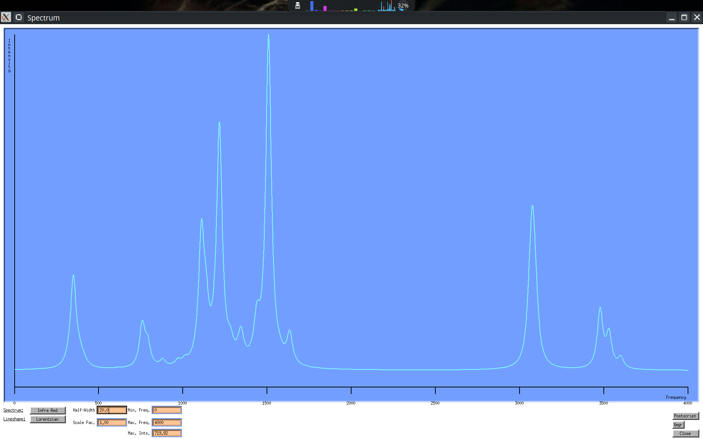

Imagen del anhidrido acético en agua:

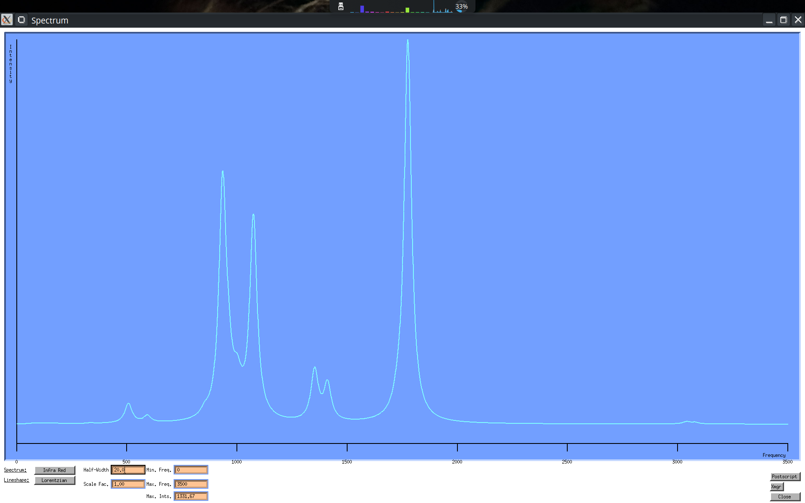

Al transicionar a un sistema real solvatado, las moléculas interactúan con su entorno físico a través de **interacciones intermoleculares** (fuerzas de van der Waals y puentes de hidrógeno).

**1. Alteración de los Modos Vibracionales:**
* **Ensanchamiento y desplazamiento:** En presencia de solvente, las señales del $\nu_{O-H}$ (>3600 $cm^{-1}$) y $\nu_{N-H}$ (>3400 $cm^{-1}$) se desplazan hacia un rango de menor frecuencia (entre 3200-3400 $cm^{-1}$). Este fenómeno ocurre debido a que los dipolos del solvente ejercen atracción electrostática sobre el protón, elongando el enlace X-H. Esta elongación disminuye la fuerza del enlace, lo que reduce la frecuencia de vibración, mientras que los varios estados de solvatación provocan el ensanchamiento de la banda.

* **Estado vibracional del carbonilo:** Las moléculas de solvente interactuarán con los oxígenos de los carbonilos del anhídrido acético, estabilizándolos y desplazando levemente sus frecuencias de vibración desde los valores teóricos altos (~1850-1900 $cm^{-1}$) hacia valores experimentales más bajos (1750-1820 $cm^{-1}$).

**2. Implicaciones fisicoquímicas en la interacción de los reactivos:**

* **Efecto sobre el Electrófilo (Activación):** La solvatación de los átomos de oxígeno del anhídrido acético incrementa la polarización de los enlaces $C=O$ ($C^{\delta+} = O^{\delta-}$). Al mover densidad electrónica hacia el oxígeno, el carbono del carbonilo incrementa su propiedad electrofílica, reduciendo la energía de activación de la barrera de ataque nucleofílico.
* **Efecto sobre el Nucleófilo:** Si el solvente forma puentes de hidrógeno con el grupo amino del p-aminofenol, el par libre del nitrógeno estará estabilizado por el solvente. Para que la reacción ocurra, el sistema debe invertir energía en desolvatar este grupo amino antes de poder atacar al anhídrido. 

---

#### d) Contraste de números de onda (Sistemas con vs. sin solvente) y Discusión

**Incremento de Intensidades de Infrarrojo:**
La comparación cuantitativa de los espectros muestra un salto masivo en la intensidad de las señales:
* El máximo de intensidad del anhídrido acético pasa de **750.68** a **1331.67** (agua).
* El máximo de intensidad del p-aminofenol pasa de **476.80** (gas) a **719.82** (agua).

El modelado evidencia que el solvente es una parte fundamental de la reacción. La diagonalización de la matriz Hessiana para los sistemas en medios acuosos muestra que la estabilización de los enlaces polares reduce las constantes de fuerza locales ($k$). Esto se corrobora en los espectros ir mediante claros desplazamientos de las frecuencias que casi duplica la intensidad de la vibración.

# 4. Orbitales de frontera (HOMO y LUMO)

La reactividad química entre dos molécula puede analizarse a través de la Teoría de Orbitales Moleculares. Esta teoría establece que las interacciones iniciales más importantes y energéticamente favorables que conducen a la formación de un enlace ocurren entre los orbitales moleculares de la capa de valencia de los reactivos involucrados.

## a) Concepto de HOMO y LUMO

Los orbitales de frontera se definen mediante los siguientes conceptos:

* **HOMO (Highest Occupied Molecular Orbital - Orbital Molecular Ocupado de Mayor Energía):** Representa el nivel de energía más alto que contiene electrones de valencia en la molécula. Físicamente, estos electrones son los menos fuertemente atraídos por los núcleos atómicos y, por tanto, son los más susceptibles a ser cedidos o compartidos. El HOMO está directamente relacionado con la capacidad donar electrones de la especie, definiendo su carácter nucleofílico.

* **LUMO (Lowest Unoccupied Molecular Orbital - Orbital Molecular Desocupado de Menor Energía):** Corresponde al estado energético vacío más bajo disponible en la molécula. Constituye la región óptima para la aceptación de electrones. El LUMO define la capacidad aceptora de electrones de la molécula, estableciendo su carácter electrofílico.

En la predicción de la reactividad, la interacción primordial se da entre el HOMO de una molécula y el LUMO de la otra. 

## b) Esquemas e identificación en Multiwfn

En el análisis con Multiwfn, la identificación de los orbitales se realiza con los siguientes pasos:

1.  Se carga el archivo de la función de onda (`molden.input`).

2.  Se accede a la interfaz de orbitales (opción 0 del menú principal).

3.  El software lista los orbitales moleculares ordenados por energía.
y en la temrinal se muestra el numero del orbital que es el HOMO y el LUMO.

A continuación, se presentan los esquemas extraídos del programa:

**Reactivo 1: Anhídrido Acético**

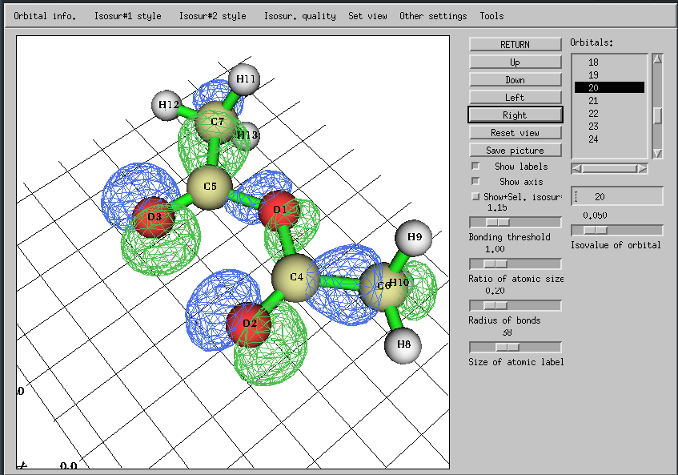

*Figura 1: Representación del HOMO (Orbital 20) para el anhidrido acetico.*

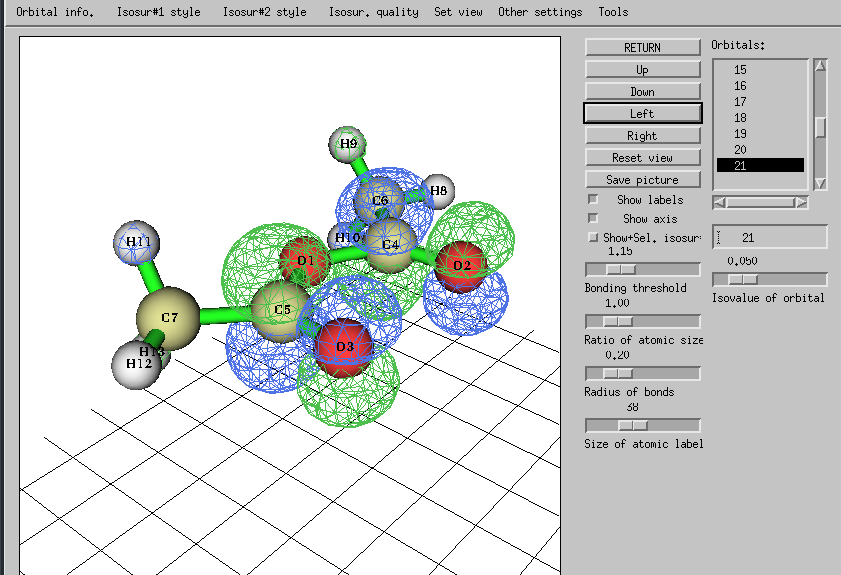

*Figura 2: Representación del LUMO (Orbital 21) para el anhidrido acetico.*

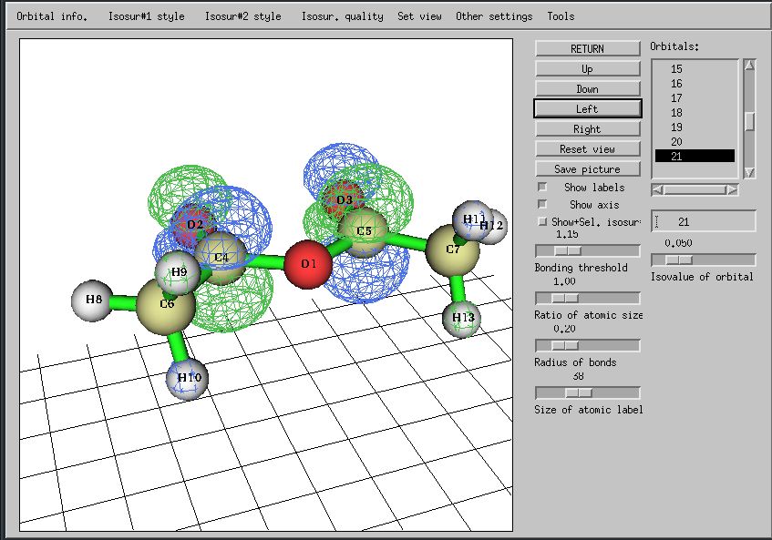

*Figura 3: Representación alternativa del LUMO (Orbital 21) para el anhidrido acetico, evidenciando la simetría de los lóbulos sobre los carbonilos.*

**Reactivo 2: Aminofenol**

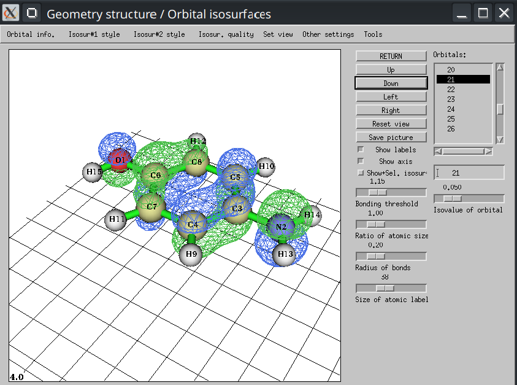

*Figura 4: Representación del HOMO (Orbital 21) para el aminofenol.*

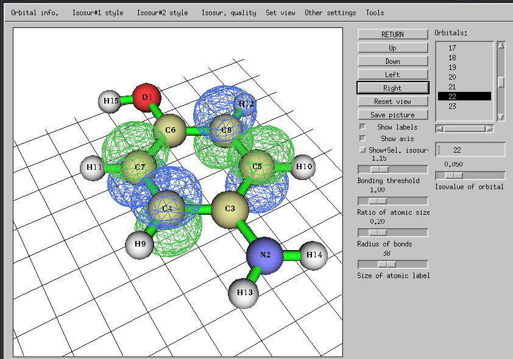

*Figura 5: Representación del LUMO (Orbital 22) para el aminofenol.*

## c) Análisis de HOMO y LUMO de cada reactivo y su relación con la reactividad

**Análisis del Anhídrido Acético:**
* **HOMO (Orbital 20):** La densidad electrónica se localiza predominantemente sobre los átomos de oxígeno (tanto los oxígenos carbonílicos como el oxígeno central). Estos lóbulos corresponden a pares de electrones  no enlazantes perpendiculares al sistema $\pi$ de los carbonilos. 

* **LUMO (Orbital 21):** Presenta un carácter fuertemente antienlazante $\pi^*$ concentrado sobre los grupos carbonilo ($C=O$). Es fundamental notar el gran tamaño de los lóbulos sobre los átomos de carbono carbonílicos. Esto indica que estos carbonos son los centros electrofílicos principales, por lo que el ataque nucleofílico debe darse en esta parte.

**Análisis del Aminofenol:**
* **HOMO (Orbital 21):** Se observa una marcada deslocalización $\pi$ sobre el anillo aromático, con densidad sobre los heteroátomos (el nitrógeno del grupo amino y el oxígeno del grupo hidroxilo). La presencia de densidad en estos heteroátomos indica un carácter nucleofílico. 

* **LUMO (Orbital 22):** Consiste en un sistema antienlazante $\pi^*$ distribuido a lo largo del anillo, característico de compuestos aromáticos. Las múltiples superficies sobre los enlaces C-C indican su alta energía y su naturaleza inestable para la retención electrónica.

**Discusión de la reactividad inicial:**
Considerando las propiedades electrónicas descritas, la reactividad inicial entre el anhídrido acético y el aminofenol estará dictada por la transferencia de densidad electrónica desde el **HOMO del aminofenol** hacia el **LUMO del anhídrido acético**. 

El aminofenol actuará como el nucleófilo. El HOMO muestra que la densidad electrónica está disponible tanto en el nitrógeno como en el oxígeno. Dado que el nitrógeno es menos electronegativo que el oxígeno, sus electrones de valencia se encuentran a un nivel de energía mayor, haciendo del grupo amina el sitio de ataque indicado. 

Por otro lado, el anhídrido acético actuará como el electrófilo. La forma de su LUMO muestra de forma explícita que la inserción de electrones se encuentra sobre los carbonos carbonílicos. Por tanto, el evento de reacción inicial implicará el solapamiento del lóbulo del HOMO ubicado en el átomo de nitrógeno del aminofenol con el gran lóbulo del LUMO ubicado en el carbono carbonílico del anhídrido acético. Este solapamiento promueve la transferencia de carga que inicia la formación de un nuevo enlace C-N, forzando simultáneamente la ruptura del enlace C-O.

# 5. Mecanismo de reacción y Pasos intermedios

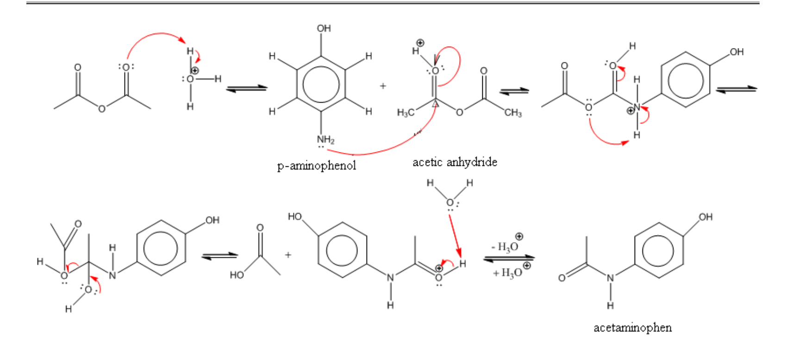

*Figura 5: Mecanismo de reacción para la síntesis de acetaminofén.*

El mecanismo de reacción ilustrado en la figura corresponde a una típica **Sustitución Nucleofílica en el Acilo**.
1. **Ataque Nucleofílico:** El nitrógeno del grupo amina del p-aminofenol, aprovechando su par de electrones libres (cuyo alto nivel de energía fue identificado en el análisis de su HOMO), ataca al carbono del carbonilo del anhídrido acético. 
2. **Formación del Intermedio:** Este choque rompe el enlace $\pi$ del carbonilo, desplazando la densidad electrónica hacia el oxígeno y generando un intermedio inestable. En este estado transitorio, el carbono atacado cambia su hibridación de $sp^2$ a $sp^3$. El nitrógeno adquiere temporalmente una carga formal positiva al sostener 4 enlaces, mientras que el oxígeno empujado se carga negativamente.
3. **Eliminación y Transferencia de Protón:** La alta densidad electrónica del oxígeno negativo se utiliza para restaurar el enlace doble del carbonilo ($C=O$). Esto fuerza la ruptura del enlace C-O adyacente, expulsando a el ión acetato. De forma simultánea, el nitrógeno cede su protón extra ($H^+$) al ión acetato, neutralizando ambas especies y arrojando los productos finales: Acetaminofén y Ácido Acético.

### Frecuencias 
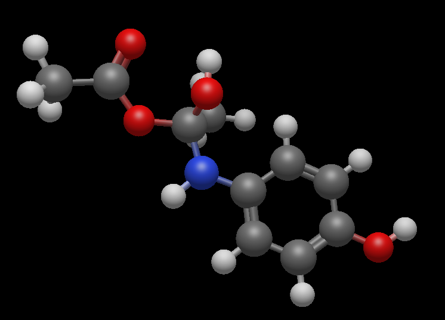

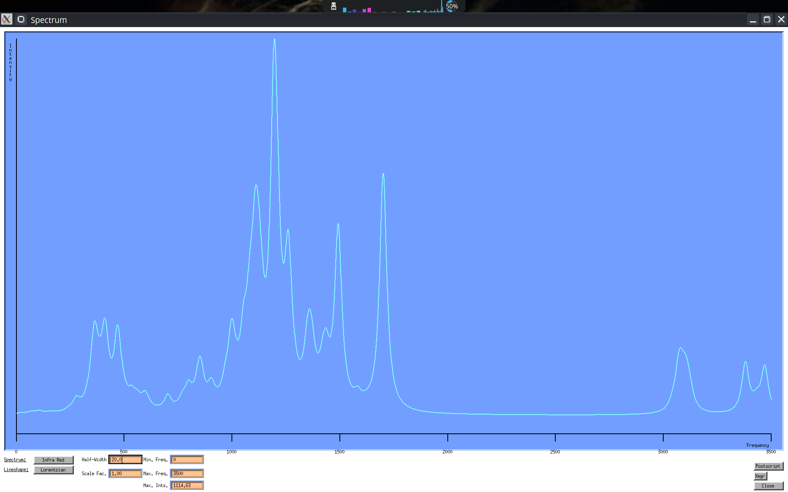

*Figura 6: Frecuencia de vibración del intermedio en agua*

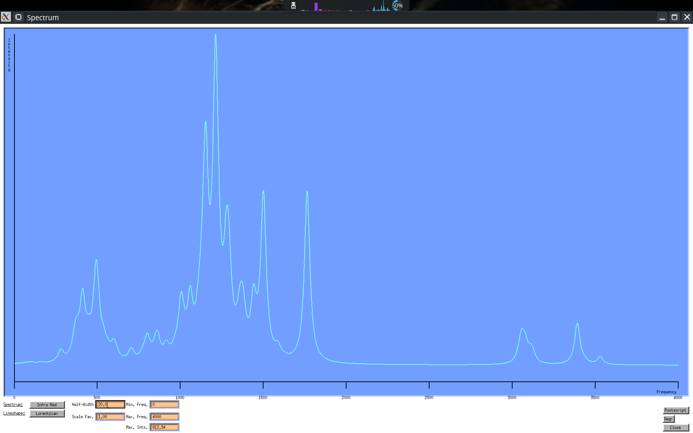

*Figura 7: Frecuencia de vibración del intermedio en fase gaseosa*

**Discusión de Frecuencias (Intermedio):**
Al formarse el intermedio, el espectro infrarrojo modelado sufre un cambio drástico respecto a los reactivos aislados:
*   **Desaparición de las vibraciones de los carbonilos del anhídrido:** Las señales masivas alrededor de ~1850-1900 $cm^{-1}$ desaparecen por completo. Esto prueba computacionalmente que la estructura rígida del anhídrido ha colapsado y la resonancia acoplada de sus dos carbonilos se rompe después del ataque nucleofílico.
*   **Densidad de enlaces C-O:** Se observa una intensificación de señales en la "región de la huella dactilar" (1000 - 1300 $cm^{-1}$) debido al carbono central $sp^3$, el cual ahora sostiene múltiples enlaces simples polarizados con el oxígeno y el grupo saliente.
*   **Efecto de la Solvatación:** Al comparar el intermedio gaseoso frente al acuoso, se nota que en el agua la intensidad de los estiramientos heteroatómicos (O-H y N-H por encima de 3000 $cm^{-1}$) se multiplican. Debido a que el intermedio tiene una gran separación de cargas (un oxígeno negativo y un nitrógeno positivo), el medio acuoso simulado (ALPB) interactúa de forma extrema con puentes de hidrógeno. 

### HOMO y LUMO

*   **HOMO :** El HOMO del intermedio  revela que la mayor densidad electrónica, se concentran fuertemente sobre el átomo de oxígeno que acaba de absorber el enlace $\pi$ roto. Este oxígeno (cargado negativamente en el mecanismo), buscando donar ese par de electrones para volver a formar el doble enlace termodinámicamente estable.

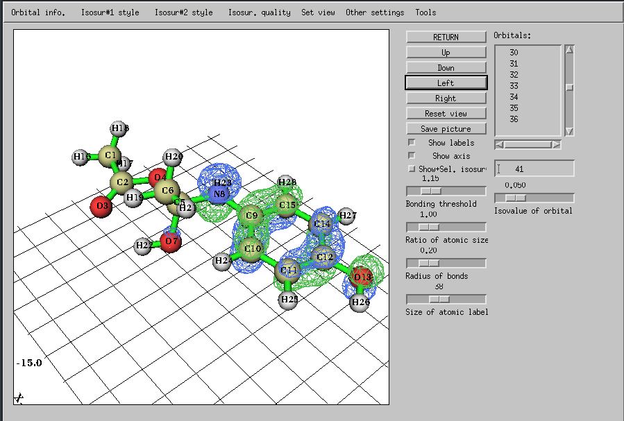

*Figura 8: HOMO del intermedio.*

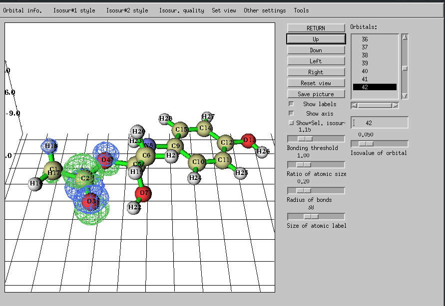

*Figura 9: LUMO del intermedio.*

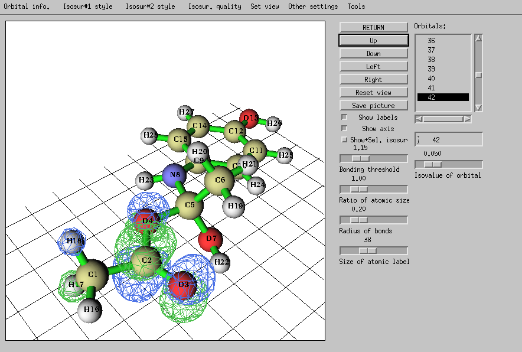

*Figura 10: LUMO del intermedio.*

# Productos

### Frecuencias 

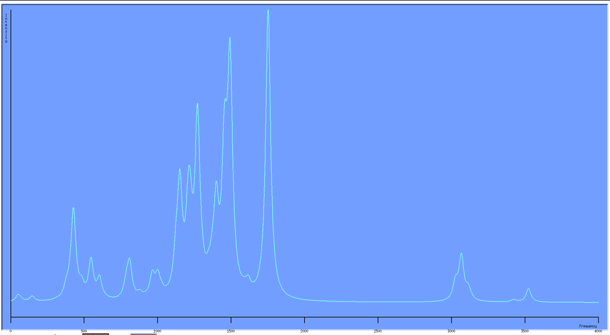

*Figura 11: Frecuencia de vibración del acetaminofén en estado gaseoso.*

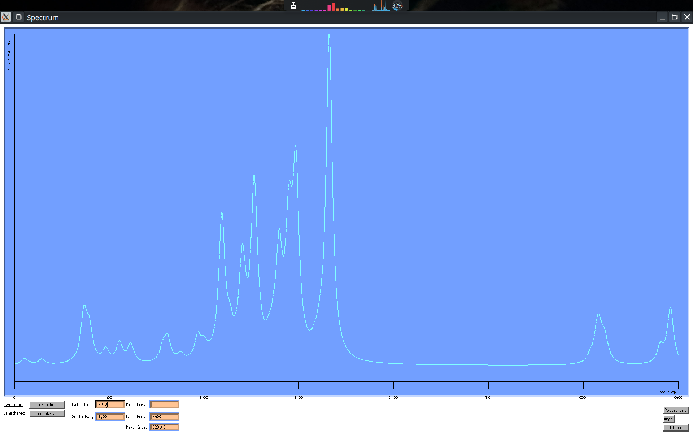

*Figura 12: Frecuencia de vibración del acetaminofén en agua*

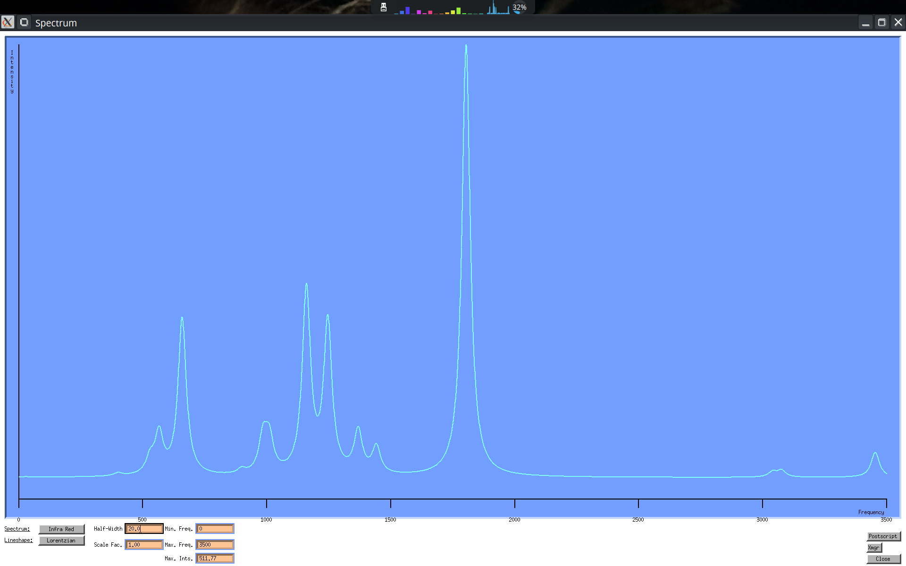

*Figura 13: Frecuencia de vibración del ácido acético en estado gaseoso*

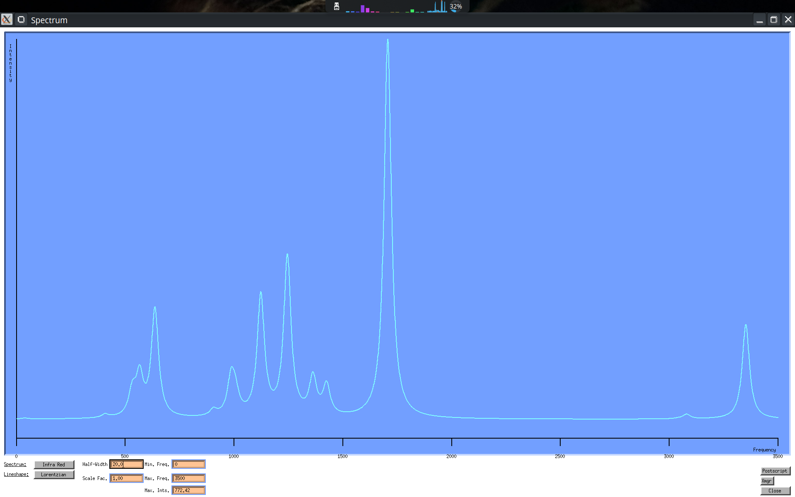

*Figura 14: Frecuencia de vibración del ácido acético en agua*

**Discusión de Frecuencias (Productos):**

*   **La Amida  (Acetaminofén):** Aparece una absorción en el rango de ~1650 - 1680 $cm^{-1}$. Esta es la firma del grupo acetamida. Su frecuencia es menor a la del carbonilo del anhídrido original; esto ocurre porque el par libre del nitrógeno ahora participa en una estabilización por resonancia con el oxígeno adyacente, reduciendo la fuerza del enlace $C=O$.

*   **Estiramiento N-H y O-H:** En la fase gas, los estiramientos del N-H de la amida y el O-H del fenol se ven como picos delgados. Sin embargo, al modelarse en agua, estas bandas se fusionan de forma ancha y difusa debido a la interacción de puentes de hidrógeno.
*   **Ácido Acético (Subproducto):** Muestra la banda de stretching $C=O$ de ácido carboxílico cerca de los ~1700 $cm^{-1}$, acoplada a una banda muy ancha provocada por el estiramiento O-H del grupo carboxilo afectado  por el modelo ALPB de agua.

### HOMO y LUMO

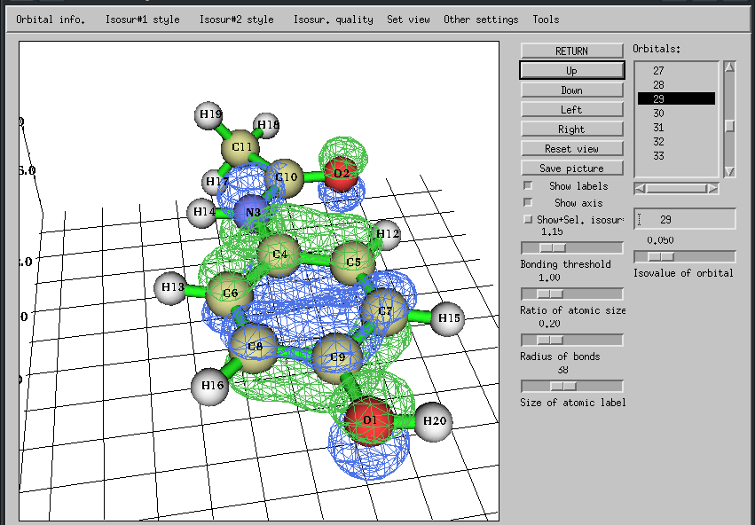

*Figura 15: HOMO del acetaminofén.*

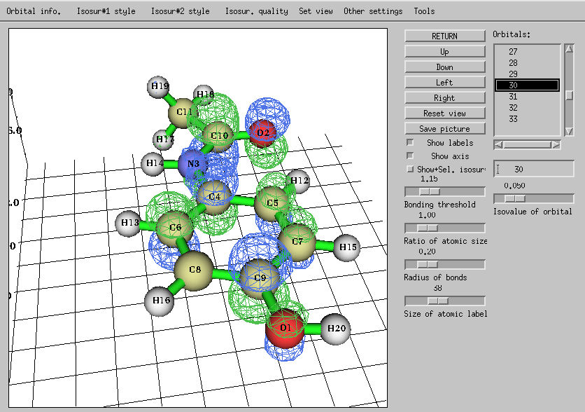

*Figura 16: LUMO del acetaminofén.*

La configuración electrónica del producto final constata la culminación exitosa de la reactividad:
*   **HOMO:** En la molécula de acetaminofén, el HOMO se encuentra deslocalizado a lo largo del anillo aromático y el oxígeno fenólico. Es importante notar que el grupo acetamida recién creado (específicamente el nitrógeno que originalmente atacó) ya no posee la alta densidad electrónica que mostraba en los reactivos. La reacción ha estabilizado sus electrones al entrelazarlos por resonancia con el oxígeno del carbonilo, suprimiendo la nucleofilicidad inicial.
*   **LUMO:** El LUMO se distribuye de manera fragmentada sobre el anillo aromático mostrando nodos netamente antienlazantes ($\pi^*$). La ausencia de grandes lóbulos (como los que exhibía el electrófilo original) comprueba que el acetaminofén carece de centros electrofílicos importantes. El fármaco se ha vuelto altamente estable frente a colisiones aleatorias en el medio acuoso.

## Mejora de script: `script_thermo_xtb_complete_all.py` vs `new_thermo.py`

A continuación, se detallan las principales diferencias y las ventajas que introducen:

#### 1. Corrección de Errores Termodinámicos y Matemáticos 

*   **Aislamiento de la Energía de Punto Cero (ZPE):** En el script original, la ZPE se sumaba múltiples veces de manera redundante (a la entalpía, y luego dos veces más en el cálculo de Gibbs), lo que resultaba en un sobrecálculo de la Energía Libre final. La nueva versión calcula y aísla la ZPE, sumándola una única vez al estructurar todo con la ecuación formal: $H_{total} = SCF + H_{thermal} + ZPE$ y $G_{total} = H_{total} - TS$.
*   **Constantes Físicas Universales:** Se eliminó el factor de conversión erróneo (`0.0002909`) usado para pasar frecuencias a kilocalorías. Ahora se utiliza de forma explícita la constante física $hc/k_B$ (`1.4388`), corrigiendo el error de magnitud.

*   **Cálculo Correcto de la Entalpía ($H$):** El script anterior asignaba la Entalpía de traslación como $\frac{3}{2}RT$, confundiéndola con la Energía Interna ($U$). La refactorización ahora suma rigurosamente todas las energías internas y al final aplica la corrección térmica general sumando el término $RT$.
*   **Grados de Libertad Rotacional:** Se ajustaron los aportes entrópicos para moléculas lineales y no lineales reflejando la teoría cinética de gases ideales.

### 2. Vectorización con NumPy y Estabilidad

Se sustituyeron los bucles *for* por operaciones vectorizadas en matrices de `NumPy`. Esto permite evaluar las ecuaciones térmicas para todos los modos vibracionales de forma simultánea, acelerando la ejecución.

*   **Estabilidad en Evaluaciones Logarítmicas:** Se implementó una protección matemática (`+ 1e-12`) dentro del cálculo de la entropía vibracional al usar `np.log`. Esto previene caídas repentinas del script o errores de tipo al enfrentarse a logaritmos de cero en escenarios de temperaturas muy bajas o frecuencias muy altas.
*   **Interfaz de Línea de Comandos (CLI) Dinámica:** La propiedad estructural de linealidad pasó de estar puesta como predeterminada (`is_linear_molecule=True`) dentro del archivo, a dinámica desde la terminal (`--linear`), flexibilizando enormemente el uso del script.

---

# 6. Resumen de Potenciales Termodinámicos 

## A. Justificación de las Temperaturas Evaluadas

Para realizar un análisis termodinámico riguroso, se escogieron tres temperaturas específicas basándose en los reportes de la literatura de la síntesis del acetaminofén:

1. **298.15 K (25 °C - Temperatura Ambiente):** Es la temperatura a la cual se desarrolla la reacción según el protocolo de la Royal Society of Chemistry [2] y el Método IV de Srabovic et al [1]. Modela el estado natural de los reactivos y productos sin estimulación térmica extra.

2. **353.15 K (80 °C - Fase de Purificación):** Es la temperatura mencionada en la literatura [2] a la cual se disuelve el producto crudo en agua para su recristalización.

3. **373.15 K (100 °C - Reflujo/Baño María):** Modela los métodos I, II y III de síntesis [1], donde se somete el sistema a ebullición o reflujo para acelerar la reacción.

## B. Tablas de Potenciales Termodinámicos

Para facilitar la comparativa del efecto de solvatación, los resultados se han separado en tablas según la temperatura:

### Tabla 6.1 - Potenciales a 298.15 K (Temperatura Ambiente)

| Molécula | Entorno | ZPE (eV) | Entalpía $H_{tot}$ (eV) | Entropía $S_{tot}$ (kcal/mol·K) | Gibbs $G_{tot}$ (eV) |
| :--- | :--- | :--- | :--- | :--- | :--- |
| Aminofenol | Gas | 3.15887 | -633.04273 | 0.02095 | -633.31358 |
| Aminofenol | Agua | 3.14689 | -633.37222 | 0.02093 | -633.64278 |
| Anhídrido Acético | Gas | 2.59714 | -645.64562 | 0.02795 | -646.00694 |
| Anhídrido Acético | Agua | 2.58069 | -645.97437 | 0.03268 | -646.39685 |
| Molécula Intermedia | Gas | 5.87722 | -1279.52211 | 0.06262 | -1280.33169 |
| Molécula Intermedia | Agua | 5.84221 | -1280.05956 | 0.06216 | -1280.86322 |
| Acetaminofén | Gas | 4.19795 | -887.57917 | 0.03782 | -888.06818 |
| Acetaminofén | Agua | 4.17908 | -888.03847 | 0.03782 | -888.52747 |
| Ácido Acético | Gas | 1.62007 | -391.70097 | 0.01679 | -391.91800 |
| Ácido Acético | Agua | 1.60323 | -392.04727 | 0.01621 | -392.25686 |

### Tabla 6.2 - Potenciales a 353.15 K (80 °C - Recristalización)

| Molécula | Entorno | ZPE (eV) | Entalpía $H_{tot}$ (eV) | Entropía $S_{tot}$ (kcal/mol·K) | Gibbs $G_{tot}$ (eV) |
| :--- | :--- | :--- | :--- | :--- | :--- |
| Aminofenol | Agua | 3.14689 | -633.29610 | 0.02497 | -633.67853 |
| Anhídrido Acético | Agua | 2.58069 | -645.90117 | 0.03652 | -646.46042 |
| Acetaminofén | Agua | 4.17908 | -887.93119 | 0.04408 | -888.60618 |
| Ácido Acético | Agua | 1.60323 | -392.00500 | 0.01786 | -392.27852 |

### Tabla 6.3 - Potenciales a 373.15 K (100 °C - Reflujo)

| Molécula | Entorno | ZPE (eV) | Entalpía $H_{tot}$ (eV) | Entropía $S_{tot}$ (kcal/mol·K) | Gibbs $G_{tot}$ (eV) |
| :--- | :--- | :--- | :--- | :--- | :--- |
| Aminofenol | Agua | 3.14689 | -633.26568 | 0.02647 | -633.69394 |
| Anhídrido Acético | Agua | 2.58069 | -645.87252 | 0.03790 | -646.48580 |
| Acetaminofén | Agua | 4.17908 | -887.88851 | 0.04635 | -888.63850 |
| Ácido Acético | Agua | 1.60323 | -391.98842 | 0.01848 | -392.28739 |

*(Los valores para la fase Gas a altas temperaturas y del intermedio se han documentado en el archivo CSV anexo, priorizando aquí la fase acuosa que es la de la reacción experimental).*

---

## C. Discusión Detallada de la Termodinámica Involucrada

### 1. Espontaneidad y Calor de Reacción ($\Delta G$ y $\Delta H$)
Podemos evaluar la termodinámica global del paso de síntesis utilizando los datos a **298.15 K en agua** para la reacción:
**4-Aminofenol + Anhídrido Acético $\rightarrow$ Acetaminofén + Ácido Acético**

*   **Entalpía de los Reactivos:** $(-633.372) + (-645.974) = -1279.346 \text{ eV}$
*   **Entalpía de los Productos:** $(-888.038) + (-392.047) = -1280.085 \text{ eV}$
*   **$\Delta H_{reaccion}$** = $-1280.085 - (-1279.346) = \mathbf{-0.739 \text{ eV}}$

El valor negativo de la entalpía ($\Delta H < 0$) demuestra que la reacción es **exotérmica**. El sistema libera energía en forma de calor al formar enlaces amida más estables, lo que coincide directamente con los reportes experimentales de la *Royal Society of Chemistry* que indican que el recipiente se calienta.

Calculando la Energía de Gibbs del sistema:
*   **Gibbs de Reactivos:** $(-633.642) + (-646.396) = -1280.038 \text{ eV}$
*   **Gibbs de Productos:** $(-888.527) + (-392.256) = -1280.783 \text{ eV}$
*   **$\Delta G_{reaccion}$** = $-1280.783 - (-1280.038) = \mathbf{-0.745 \text{ eV}}$ (Aprox. **-17.17 kcal/mol**)

La energía de Gibbs fuertemente negativa ($\Delta G \ll 0$) afirma que la síntesis de acetaminofén es **altamente espontánea y termodinámicamente favorable** a temperatura ambiente.

### 2. Energía de Solvatación (Efecto del Entorno Agua vs Gas)
Comparar las Tablas revela por qué el agua es un buen solvente para esta reacción. 
Para el **acetaminofén a 298.15 K**, $G_{tot}$ en gas es -888.068 eV, mientras que en agua desciende a -888.527 eV. Esta diferencia de **-0.459 eV** corresponde a la **energía de solvatación**. El modelo ALPB demuestra que las moléculas de agua polarizan y estabilizan los grupos funcionales (-OH y -NH-CO-) de la molécula a través de puentes de hidrógeno, disminuyendo la energía libre del sistema. Todos los componentes de la reacción (reactivos y productos) son un poco más estables en agua que en fase gaseosa.

### 3. Cambios en la Temperatura 
Si la reacción es exotérmica y espontánea a 25 °C, ¿por qué calentar el sistema a reflujo (100 °C / 373.15 K)? 
Al observar la Tabla 6.3, notamos que a 373.15 K la entropía ($S_{tot}$) aumenta por la agitación térmica. Esto hace que las energías de Gibbs sean aún más negativas ($G = H - TS$).

Sin embargo, el calentamiento no se hace por razones termodinámicas, sino por **cinética química**. Aplicar calor a 373.15 K proporciona la energía de activación necesaria para acelerar las colisiones efectivas entre el aminofenol y el anhídrido acético, reduciendo el tiempo de reacción de 30 minutos (a temperatura ambiente) a tan solo 15 minutos (a reflujo).

### 4. Estabilidad de la Molécula Intermedia
Los cálculos muestran una observación interesante: el intermedio en agua tiene un $G_{tot}$ de **-1280.863 eV**, lo cual es más bajo (más estable) que la suma de los productos separados (-1280.783 eV). Esto sugiere computacionalmente que el intermedio se estabiliza. En la realidad, la ruptura del enlace C-O para la eliminación del ión acetato es impulsada por la ganancia de entropía.

# 7. Conclusiones

## A. Potencialidad de la modelación computacional
La química computacional ha demostrado ser una herramienta excelente para comprender los eventos microscópicos que rigen la síntesis del acetaminofén. Su mayor potencialidad radica en hacer visible lo invisible:
*   **Sustento del mecanismo de reacción:** Se pudo validar el mecanismo de sustitución nucleofílica al observar de forma visual y numérica cómo la localización de los orbitales HOMO (en el nucleófilo) y LUMO (en el electrófilo) dictan la trayectoria exacta de la reacción.
*   **Predicción y Cuantificación Termodinámica:** La modelación permitió calcular que la reacción tiene un $\Delta H < 0$ y un $\Delta G < 0$, justificando matemáticamente las observaciones macroscópicas reportadas en el laboratorio (la liberación de calor y la espontaneidad del proceso).
*   **Análisis del Entorno:** Simulando el sistema en fase gas y en agua, se pudo aislar y cuantificar la energía de solvatación, demostrando de forma contundente por qué el agua es un solvente ideal que estabiliza las especies polares e intermedios cargados a lo largo de la ruta de síntesis.

## B. Capacidades y limitaciones de xTB
**Capacidades en nuestro caso puntual y general:**
*   **Eficiencia Computacional:** xTB (específicamente la parametrización GFN2-xTB) permitió realizar optimizaciones de geometría, cálculos de frecuencias vibracionales y extracción de orbitales moleculares para sistemas medianos en tiempos excepcionalmente cortos. Lograr esto mismo usando métodos *ab initio* o DFT tradicionales consumiría demasiados recursos y tiempo.
*   **Modelo de Solvatación Robusto:** La inclusión del modelo ALPB demostró ser capaz de capturar la estabilización de los reactivos por el solvente, reflejando cambios lógicos y profundos en los espectros infrarrojos y en los potenciales termodinámicos.

**Limitaciones:**
*   **Aproximaciones Semiempíricas:** Al basarse en aproximaciones de enlace fuerte (tight-binding) y parámetros pre-ajustados, los valores energéticos absolutos pueden tener desviaciones respecto a niveles de teoría superiores. Por ejemplo, la estabilidad calculada para la molécula intermedia ($G_{tot} = -1280.863$ eV) respecto a los productos separados ($G_{tot} = -1280.783$ eV) podría ser un artefacto de sobreestabilización del modelo ALPB al tratar un estado transitorio fuertemente polarizado.
*   **Frecuencias Armónicas Sin Escalar:** Las frecuencias infrarrojas se calculan bajo la aproximación del oscilador armónico. Al no considerar la anarmonicidad natural de los enlaces ni contar con factores de escalado predeterminados, las bandas teóricas (como el estiramiento de los dobles enlaces) suelen aparecer desplazadas hacia números de onda más altos en comparación con un espectro IR experimental.

---

## Referencias

1. Srabovic, M., Huremovic, M., Catovic, B., Kulic, S., & Taletovic, A. (2017). Design synthesis and crystallization of acetaminophen. *Journal of Chemical, Biological and Physical Sciences*, 7(1), 218-230.
2. Ellis, F. (2002). *Paracetamol - a curriculum resource*. Royal Society of Chemistry.
3. Amin, M., & Iqbal, M. S. (2015). *Solvent free synthesis of acetaminophen* (U.S. Patent No. 9,006,488 B1). U.S. Patent and Trademark Office.
4. Parveen, S., et al. (2023). Two-Step Synthesis of Paracetamol: A Laboratory Experiment for Undergraduate Students. *Journal of Chemical Education*.
5. *How Efficient Is My (Medicinal) Chemistry?* (2016). *Pharmaceuticals*, 9(3), 44.

6.  Bannwarth, C., Ehlert, S., & Grimme, S. (2019). GFN2-xTB—An accurate and broadly parametrized self-consistent tight-binding quantum chemical method with multipole electrostatics and density-dependent dispersion contributions. *Journal of Chemical Theory and Computation*, 15(3), 1652-1671.
7.  Burgina, E. B., Baltakhinov, V. P., & Krivdin, L. B. (2004). Vibrational spectra of paracetamol. *Journal of Structural Chemistry*, 45(1), 64-73. (p. 66).
8.  Silverstein, R. M., Webster, F. X., & Kiemle, D. J. (2005). *Spectrometric Identification of Organic Compounds* (7th ed.). John Wiley & Sons. (pp. 80-100).
9.  Socrates, G. (2001). *Infrared and Raman Characteristic Group Frequencies: Tables and Charts* (3rd ed.). John Wiley & Sons. (pp. 108-132).

